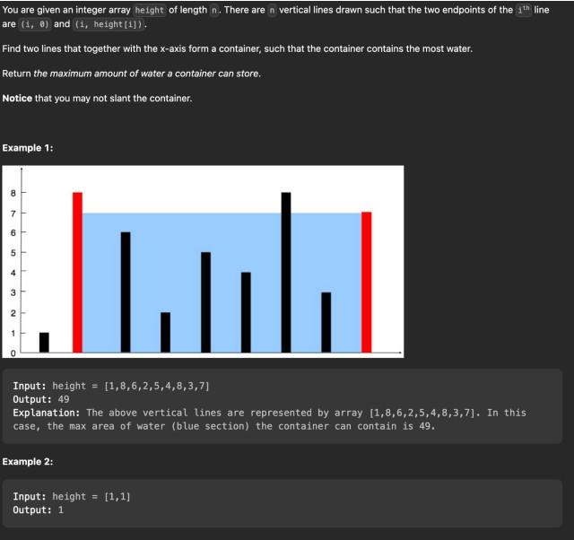

<h1>WEEK 5 ASSIGNMENT</h1>

Directions: Please answer the following questions on a VS-Code Editor page. Push up the code to a branch on GitHub called: week5
Due: Saturday by 11 AM CST  

Problem #1: Merge Sort 
Description: Congratulations! You were just hired to be a junior backend engineer at Hanawilo! As the first
task at Hanawilo, your manager has asked you to implement a sorting algorithm using the Merge sort of the
payloads coming back from the MongoDB database. The website currently is running a very slow sorting
algorithm and it is driving away customers due to the slowness, therefore, as your first task, he has assigned
you to rewrite the sorting algorithm for this payload returned from the MongoDB API fetch call. 
He has asked to return the following data in two sorting options: 
1.Merge sort (ascending order) by the rank 
2.Merge sort (ascending order) by the ratings AND rank 
Please see below for the data returned from the database 

    const data = {
        results: {
            payload: [
                {
                    profile: {
                            name: 'Tony',
                            rank: 9,
                            favorites: [
                                {
                                    title: 'Spider-Man',
                                    rating: 5
                                },
                                {
                                    title: 'Spongebob',
                                    rating: 9
                                }
                            ]
                    }
                },
                {
                    profile: {
                            name: 'John',
                            rank: 2,
                            favorites: [
                                {
                                    title: 'Hulk',
                                    rating: 1
                                },
                                {
                                    title: 'Top Gun',
                                    rating: 8
                                }
                            ]
                    }
                }
            ]
        }
    }

Problem #2: Singly Linked List: 
Please construct the two classes with the appropriate properties for the Node and SLL, then for the SLL, 
please write the methods for:  
Push() 
Pop() 

    class Node{
    constructor(val){
    }
    }
    class SinglyLinkedList{
    constructor(){
    }
    }

Problem #3: Please solve this pattern using time complexity of O(n) and using the CORRECT PATTERN!

    /**
    * @param {number[]} height
    * @return {number}
    */
    const maxArea = (height) => {
    
    };